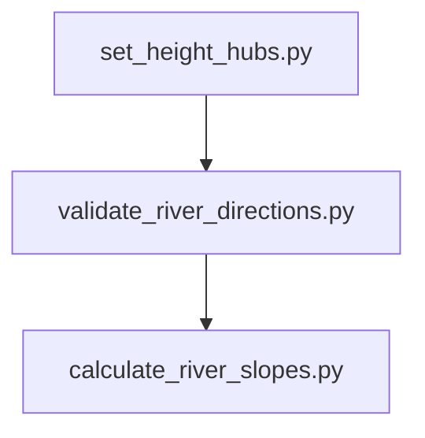

# Examples

Here, you can find some basic examples on how to use Si.T.T.

To facilitate usage, the example were created as Jupyter notebooks. These are:

* [Basic Tutorial](01_basic_tutorial.ipynb)

## Sample Files

This folder contains a score of sample files that help prepare and shape the geo data for the simulation.

* [calculate_river_slopes.py](calculate_river_slopes.py): This is an example how to calculate river slopes (inclines)
  using hub heights (z-heights).
* [create_sql_from_dump.py](create_sql_from_dump.py): Example of how to reimport a dump into SQL.
* [raster_river_profiles.py](raster_river_profiles.py): Test for xyz files.
* [read_shape_file_into_db.py](read_shape_file_into_db.py): Example of how to read a Shape file (.shp) into the
  database.
* [set_height_hubs.py](set_height_hubs.py): Script set the hub heights using a GeoTIFF or Google Elevation API.
* [simple_river_test_simulator.py](simple_river_test_simulator.py): River test simulator to check how a hypothetical
  simple agent would behave in a river network.
* [validate_river_directions.py](validate_river_directions.py): This is an example how to validate river directions and
  hub heights - are rivers flowing upwards?
* [xyz_data_to_shp.py](xyz_data_to_shp.py): Convert a xyz data file to a shapefile.
* [xyz_data_to_shp_folder.py](xyz_data_to_shp_folder.py): Convert xyz data files to shapefile in a single directory.

## How to Use the Example Files for Rivers

Here is a recommendation for the order of execution, if you want to prepare the data of river flows.

Rivers should have been created in an PostGis table, e.g. `topology.recricers`. They should contain the following
fields:

* `geom`: geometry(LineString, 4326) containing the linestrings of the river routes
* `recroadid`: unique id of route
* `hubaid`: source hub id
* `hubbid`: target hub id
* `direction`: Either `downwards` (going from A to B) or `upwards` (from B to A)
* `slope`: float (double precision) - NULL for now

Hubs should contain at least the following fields:

* `geom`: geometry(PointZ, 4326) containing the point of each hub
* `rechubid`: unique id of hub
* `height_m`: optional additional height (makes it easier to visualize the height in QGis et al.)

* [set_height_hubs.py](set_height_hubs.py) will set the heights of the hubs first, adding a z coordinate to each point,
  and - optionally - setting the height of the `height_m` field. Set fields are not overwritten by default, so one can
  use different methods to populate the heights.
* [validate_river_directions.py](validate_river_directions.py) can be run to check river directions. It can be used to
  adjust heights hubs a bit, so rivers do not flow upward.
* [calculate_river_slopes.py](calculate_river_slopes.py) will calculate the slope of each river path. Due to modern
  overbuilding and landscape shaping, we use a simplified method to calculate the slopes. We simply take the start and
  end points of each river path and calculate the slope for the whole segment.
