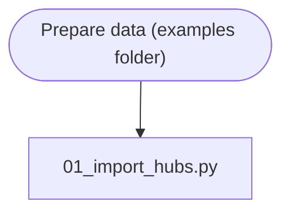

# Precalculation Scripts

This folder contains precalculation scripts (see [concept](../readmes/concept.md)). They are not part of the core
application, but can be run before starting the simulation, depending on your data. The scripts are examples only and
should be adjusted to your needs. The example folder also contains a lot of scripts to prepare data - depending on what
data you have, precalculation should have access to the following table data:

* `rechubs` containing hub data
* `recroads` containing road data
* `recrives` with detailed, precalculated river data (see [examples readme](../examples/README.md))
* `reclakes` with information on lake routes

Target schemas are available in [DB Schema](../readmes/database_schema.sql) documentation. You do not have to create
them, the scripts will do that for you.

Here a chart showing how to proceed:

Short explanations:

* [Prepare data](../examples/README.md) - this is largely dependent on your data, but in the end, you should have the
  tables mentioned above.
* [01_import_hubs.py_](01_import_hubs.py) - import hubs from `rechubs` to `sitt.hubs`
