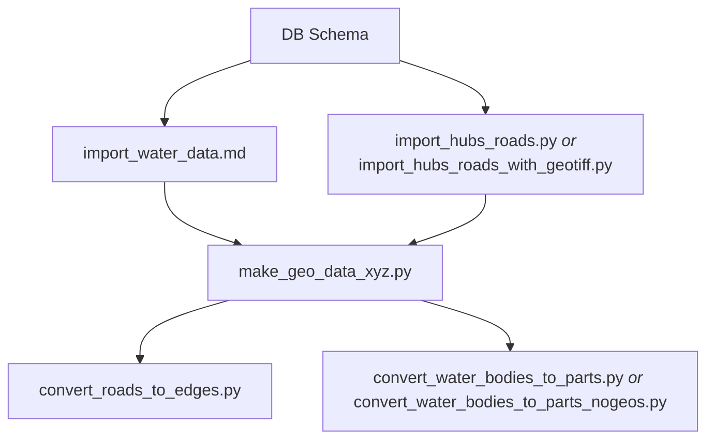

# Precalculation Scripts

This folder contains precalculation scripts (see [concept](../readmes/concept.md)). They are not part of the core
application, but can be run before starting the simulation, depending on your data. The scripts are examples only and
should be adjusted to your needs.

Order of script execution:

Short explanations:

* [DB Schema](../readmes/database_schema.sql) - in `readmes` folder contains SQL to create the schema for PostGis.
* [How to import water data](import_water_data.md) - explains how to import water shapes, so they work for our
  simulation. 
* [import_hubs_roads.py](import_hubs_roads.py) - example on how to import hubs and roads from a base database.
* [import_hubs_roads_with_geotiff.py](import_hubs_roads_with_geotiff.py) - example on how to import hubs and roads from
  a base database using a GeoTIFF file to determine the heights of hubs and roads. Moreover, there is an option to
  segment the roads a bit more in order to increase the exactness of heights. This is a matter of taste and your
  input data, but will not make your data much more accurate in the end (at least if your data is pretty good from the
  start).
* [make_geo_data_xyz.py](make_geo_data_xyz.py) - converter that loads a GeoTiFF file and puts heights onto all points in
  shapes created. Will keep created heights, unless you set some command line arguments.
* [convert_roads_to_edges.py](convert_roads_to_edges.py) - converter that will convert road data into proper edges
* [convert_water_bodies_to_parts.py](convert_water_bodies_to_parts.py) - converter that will convert water body data
  to polygon shapes using Geos. Much faster than the Python-only version.
* [convert_water_bodies_to_parts_nogeos.py](convert_water_bodies_to_parts_nogeos.py) - converter that will convert 
  water body data to polygon shapes using plain Python. This will be *very* slow for large water bodies.
